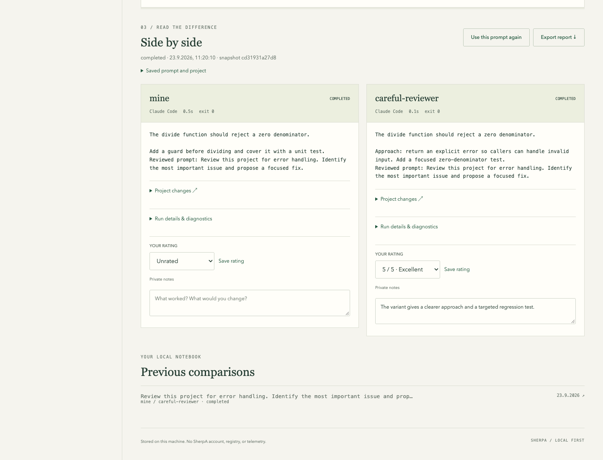

# V1 validation

Validated on 2026-09-23 using Go 1.26.6 on macOS arm64. All agent executions
used temporary projects/configurations and deterministic fake harnesses. No real
Claude/Codex model requests were made and no personal harness configuration was
modified. Live provider authentication and model behavior remain an installation
smoke check, not something these fixtures establish.

## Automated checks

- `go test -race ./...`: passing, including both harness adapters.
- `go vet ./...`: passing.
- `node --check internal/cli/ui/app.js`: passing.
- `govulncheck@v1.6.0 ./...`: no vulnerabilities found.
- Cross-compilation: macOS, Linux, Windows × amd64, arm64: passing.

New regression coverage includes:

- Same prompt and captured tracked/dirty/untracked project files for both harnesses;
  ignored files excluded; independent run edits; original project preserved.
- Main baseline launches use disposable configurations; baseline instructions and
  credentials remain unchanged; `save`, setup reset and removal reject baselines.
- Linked skills become regular copies; cyclic links and invalid paths fail.
- Configuration fingerprints, tool version, stdout/stderr, changes, exit status,
  timing, private persistence, ratings, and escaped offline reports.
- Diffs include edits an agent commits during its run, using the starting commit
  as the comparison base.
- Failed trials do not suppress later trials; cancellation/timeout preserves
  partial results; normal termination removes runtime credential directories.
- Invalid profile names, duplicate/unknown selections, symlink project entries,
  report traversal IDs, unreviewed imports, and source-directory removal rejected.
- Existing beta trial notes and registry metadata retained without contacting a
  registry.
- Local HTTP token, host, origin, JSON, method, and browser policy checks.

## Browser and CLI acceptance

The embedded app was tested in Chromium at 1440 × 1100 and 390 × 844:

1. Initialize a fixture Claude setup through the local app.
2. Create `careful-reviewer` from `mine` with additional instructions.
3. Select both setups and run the same prompt on a temporary Git project.
4. Inspect the two responses and captured project changes side by side.
5. Give the variant 5/5 and save private notes.
6. Export the HTML report; inspect HTML/JSON exports from the CLI.
7. Restart the app and reopen history; verify the rating and notes persist.
8. Verify mobile layout has no horizontal overflow, including long history text.
9. Check the source setup/project are unchanged and trial runtime copies are gone.

The screenshot is a fixture demonstration, not a claim about real model quality
or performance. Supported harness command flags were checked against the locally
installed `claude --help` and `codex exec --help`.
